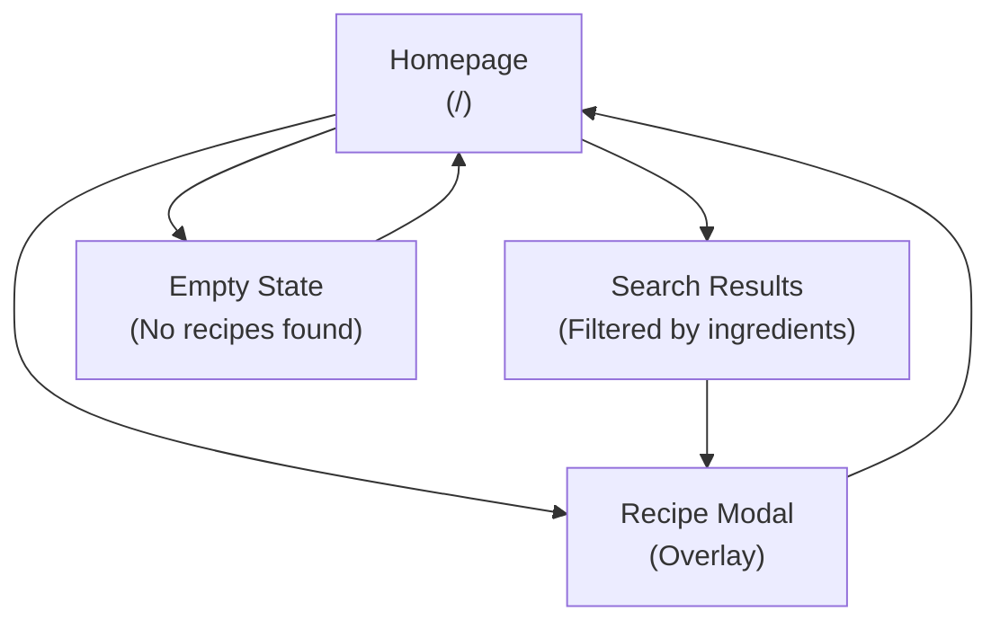

# Smoothie Recipe Angular Web App Sitemap and Core Routes

This document provides a high-level overview of the application's structure, including a sitemap diagram and a detailed table of all core application routes.

---

## Core Application Routes

This section lists the primary routes for the application, informed by the PRDs and Epics.

| Path | Component  | Feature | Description                                                                            | Access Control |
| :--- | :--------- | :------ | :------------------------------------------------------------------------------------- | :------------- |
| /    | MainLayoutContainer | home    | Main landing page with ingredient search, recipe grid, and recipe modal functionality. | Public         |

---

## Site Map / Screen Inventory

This diagram visualizes the primary screens of the application and their relationships.

